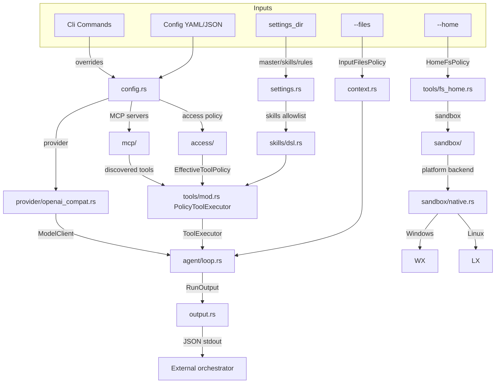
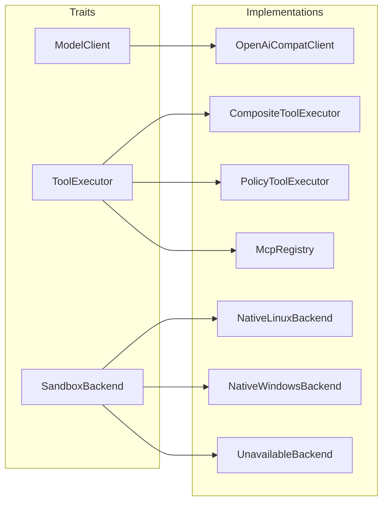
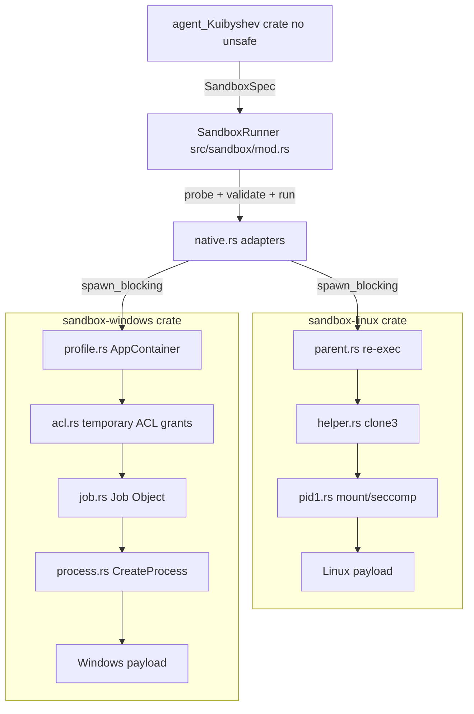

# Architecture of agent_Kuibyshev

`agent_Kuibyshev` is a minimal, reliable CLI agent worker written in Rust. It is designed to be invoked by an external orchestrator, run a single task inside an isolated sandbox, and emit exactly one JSON result on stdout. This document describes the high-level architecture, module responsibilities, and security boundaries.

## Goals

- **Worker, not orchestrator**: the CLI does not modify a target repository directly; it writes deliverables into a caller-provided `--home` workspace.
- **Fail-closed security**: optional strict access policy denies everything that is not explicitly allowed (tools, paths, programs, env vars).
- **OS-level sandboxing**: `home.run` payloads execute inside Linux namespaces or a Windows AppContainer with no network.
- **Composability**: trait-based layering allows providers, tool executors, and sandbox backends to be swapped or tested independently.
- **Single JSON contract**: regardless of success or failure, the process prints one `RunOutput` JSON document.

## Workspace layout

The repository is a Cargo workspace with three crates:

| Crate | Path | Role |
|-------|------|------|
| `agent_Kuibyshev` | repository root | Main library and CLI binary. Forbids `unsafe_code` at the lint level. |
| `sandbox-linux` | `crates/sandbox-linux` | Linux namespace sandbox with `libc` FFI. Contains all Linux-specific `unsafe`. |
| `sandbox-windows` | `crates/sandbox-windows` | Windows AppContainer sandbox with `windows-sys` FFI. Contains all Windows-specific `unsafe`. |

```mermaid
flowchart TD
    subgraph workspace [Cargo workspace]
        AGENT[agent_Kuibyshev]
        LX[sandbox-linux]
        WX[sandbox-windows]
    end

    AGENT -->|always| LX
    AGENT -->|cfg(windows)| WX
```

On non-Linux targets `sandbox-linux` compiles to a stub that always returns `Unavailable`. On non-Windows targets `sandbox-windows` is not a dependency at all. The agent crate selects the real backend via `#[cfg]` in `src/sandbox/native.rs`.

## High-level data flow

A run is bootstrapped from CLI arguments, config files, and settings. The resulting policy, tools, provider, and limits are passed into `AgentEngine`, which runs the iterative LLM loop until the goal is reached or a limit is hit. Finally a `RunOutput` JSON object is printed.



## Module responsibilities

### Bootstrap and orchestration

- `src/main.rs` — entry point. Loads dotenv, parses CLI subcommands, and for `run` starts Tokio and wires all layers. It also calls `sandbox_linux::try_run_helper()` before Tokio starts so the Linux namespace helper runs single-threaded. Management commands (`init`, `check`, …) print human text and exit codes; only `run` emits `RunOutput` JSON.
- `src/cli/` — `clap` subcommands: `run` (`RunArgs`: `--config`, `--settings-dir`, `--prompt`, `--home`, optional `--files`, limit overrides, `--save-chat-history`), `init` (`InitArgs`), and `check` (`CheckArgs`: `--config`, optional `--settings-dir`, skip flags).
- `src/commands/` — management command implementations (`init` scaffold, `check` resource probes, future convert / add-mcp / add-access). Templates for `init` live under `src/templates/agent_init/` and are embedded via `include_str!`.
- `src/config.rs` — loads and validates YAML/JSON runtime config (`provider` including optional `provider.history`, `mcp`, `limits`, `logging`, optional `access`). Embeds access DTOs owned by `access::config`, maps `AccessError` → `ConfigError`, applies CLI overrides, and resolves host paths relative to the config file directory.
- `src/settings.rs` — loads the settings directory: `master_prompt.md`, `skills.dsl`, and optional `rules.md`.
- `src/context.rs` — reads `--files` inputs, applies `InputFilesPolicy`, truncates to a char budget, and builds the context string injected into the user message.

### Agent core

- `src/agent/loop.rs` — `AgentEngine` runs the iterative LLM loop. It sends messages to the provider, parses the model's JSON directive, dispatches tool calls, collects results, enforces iteration/token/duration limits, prunes message history using `provider.history`, and emits `RunOutput`.
- `src/limits.rs` — `LimitsConfig` and `RunMetrics` track iterations, tokens, and elapsed time.
- `src/output.rs` — `RunOutput` schema: `result`, `usage`, `stop_reason`, `logs`.

### Tools and access policy

- `src/tools/mod.rs` — `CompositeToolExecutor` routes built-in `home`/`local_tools` calls and falls through to MCP; `PolicyToolExecutor` wraps it and enforces `EffectiveToolPolicy`.
- `src/tools/fs_home.rs` — built-in `home.*` tools (list, read, write, run). Enforces `HomeFsPolicy` and runs `home.run` through the sandbox runner.
- `src/tools/local_tools.rs` — built-in `local_tools.*` tools (search_docs, read_file) for repository research. Enforces `WorkspaceFsPolicy`.
- `src/access/config.rs` — raw YAML/JSON access DTOs (`AccessPolicyConfig` and nested types); no dependency on `crate::config`.
- `src/access/mod.rs` — validates/resolves DTOs into `ResolvedAccessPolicy` (`TryFrom<AccessResolveInput>`), plus `EffectiveToolPolicy`, `QualifiedTool`, `ProgramAlias`, strict vs legacy mode.
- `src/access/paths.rs` — path grant logic: `RelativeGrant`, `PathGrantScope`, `HomeFsPolicy`, `WorkspaceFsPolicy`, `InputFilesPolicy`.
- `src/skills/dsl.rs` — parses `skills.dsl` and builds the skills allowlist and prompt fragment.

### MCP and provider

- `src/mcp/mod.rs` — shared `ToolExecutor` trait and unified tool errors.
- `src/mcp/stdio_client.rs` — MCP over stdio: server lifecycle, `tools/list`, `tools/call`, JSON-RPC actor, stderr drain, JSONL logging.
- `src/mcp/http_client.rs` — MCP over Streamable HTTP.
- `src/mcp/oauth.rs` — OAuth token acquisition and persistence for MCP servers that require it.
- `src/provider/openai_compat.rs` — OpenAI-compatible `/chat/completions` client with retries.
- `src/provider/mod.rs` — `ModelClient` trait and shared provider types.

### Logging

- `src/logging/mod.rs` — initializes `tracing`, creates `Loggers` (AI/MCP/system/chat sinks).
- `src/logging/sink.rs` — async JSONL file sink with a background writer task.
- `src/logging/paths.rs` — resolves the log base directory.
- `src/logging/chat_history.rs` — persists the chat transcript (pruned to `provider.history` budgets) to JSON.

### Sandbox

- `src/sandbox/mod.rs` — `SandboxBackend` trait, `SandboxSpec`, `SandboxRunner`, `UnavailableBackend`, `MockBackend`.
- `src/sandbox/native.rs` — platform adapters that run the Linux/Windows sandbox backends inside `tokio::task::spawn_blocking`.
- `crates/sandbox-linux` — Linux implementation: re-exec helper, `clone3` namespaces, user/group maps, pivot_root, bind mounts, capability drop, seccomp, PID1 supervision.
- `crates/sandbox-windows` — Windows implementation: AppContainer profile, temporary ACL grants, Job Object, suspended process launch, token verification, network isolation check.

## Trait-based layering

The agent crate is built around three object-safe traits, all wrapped in `Arc<dyn ...>` for testability and composition:

| Trait | Responsibility | Implementations |
|-------|--------------|-----------------|
| `ModelClient` | Send chat messages to the LLM and return a completion. | `OpenAiCompatClient` |
| `ToolExecutor` | Dispatch a tool call by `server` and `tool` name and return a JSON result. | `CompositeToolExecutor`, `PolicyToolExecutor`, `McpRegistry` |
| `SandboxBackend` | Run a single payload inside the OS sandbox and return stdout/stderr/exit. | `NativeLinuxBackend`, `NativeWindowsBackend`, `UnavailableBackend`, `MockBackend` |



## Sandbox boundary

All `unsafe` code is isolated in the two sandbox crates. The root crate is compiled with `unsafe_code = "forbid"`, so the agent can never perform raw pointer or FFI operations directly. The sandbox boundary is one-way: the agent builds a `SandboxSpec` and asks the platform backend to run it; the backend returns a `SandboxOutput`.



On Linux, the helper re-execs the current binary before Tokio is initialized, sets up namespaces, pivot_root, and seccomp, then supervises the payload. On Windows, the backend uses in-process Win32 APIs to create an AppContainer process.

## Access policy and tool allowlist

The runtime uses a layered policy:

1. `access::config::AccessPolicyConfig` from YAML is validated and resolved into `ResolvedAccessPolicy` (no `config` ↔ `access` type cycle).
2. `SkillsCatalog` parses `skills.dsl` and produces a union of `allowed_tools`.
3. `McpRegistry` discovers all tools from configured MCP servers.
4. `EffectiveToolPolicy::compile` builds the final allowlist:

   ```text
   effective_builtins = KNOWN_BUILTINS ∩ access.tools.builtins ∩ skills.allowed_tools
   effective_mcp      = all discovered MCP tools (currently trusted, no skills intersection)
   effective_tools    = effective_builtins ∪ effective_mcp
   ```

5. `PolicyToolExecutor` gates every call and advertises only `effective_tools` to the model.

Path grants (`home`, `workspace`, `input_roots`) are also fail-closed in strict mode: a relative path must match an allowed prefix by component. Legacy mode preserves pre-strict behavior for backwards compatibility.

## Configuration and lifecycle

1. `main` calls `sandbox_linux::try_run_helper()` before Tokio.
2. `run()` loads config, applies CLI overrides, validates, initializes tracing and loggers.
3. Settings, skills, input files, `HomeFs`, `LocalTools`, and MCP connections are initialized.
4. The system prompt is assembled from `master_prompt.md`, optional `rules.md`, the skills fragment, and hardcoded runtime rules.
5. `AgentEngine::run` starts the loop.
6. On exit, `RunOutput` is serialized to pretty JSON and printed to stdout.

## Key security properties

- **No unsafe in the agent crate**: `unsafe_code = "forbid"` in root `Cargo.toml`.
- **Fail-closed defaults**: strict mode denies unlisted tools, paths, and programs; sandbox probe failure prevents `home.run` if programs are configured.
- **Literal argv execution**: `home.run` executes the program directly with the provided arguments; no shell interpretation.
- **Bounded output**: sandboxed runs are capped by `max_output_chars` and a deadline to avoid pipe deadlocks and runaway processes.
- **Immutable policy after startup**: `ResolvedAccessPolicy` and `EffectiveToolPolicy` are built once before the loop begins.

## Further reading

- [`CONTRACT.md`](../CONTRACT.md) — stable orchestrator interface and output schema.
- [`README.md`](../README.md) — quick start, configuration examples, and release notes.
- [`crates/sandbox-linux/TESTING.md`](../crates/sandbox-linux/TESTING.md) — Linux sandbox testing notes.
- [`settings/`](../settings/) — example agent settings directory.
- [`agent-config.example.yaml`](../agent-config.example.yaml) — example runtime config.
