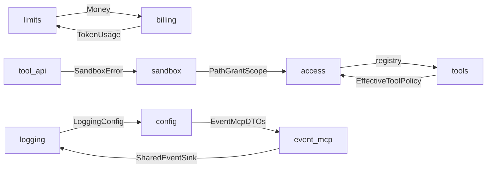

# 14 — Break the remaining module cycles

**Status:** open
**Severity:** P1
**Area:** `src/access/`, `src/tools/`, `src/limits.rs`, `src/billing/`, `src/tool_api.rs`, `src/sandbox/`, `src/logging/`, `src/config/`, `src/event_mcp/`
**Rust-skills:** `proj-mod-by-feature`, `proj-pub-use-reexport`, `api-parse-dont-validate`
**Review:** [review-2026-09.md](review-2026-09.md)

## Problem

[04](04-break-mcp-tools-cycle.md) and [05](05-break-config-access-cycle.md) removed the `mcp` ↔ `tools` and `config` ↔ `access` cycles. Four cycles remain. They force unrelated modules to compile together and make it hard to test policy, money, and logging DTOs on their own.

## Evidence

Import edges on current `main` (`use crate::`, or a fully qualified type in a struct field):

| Edge | Import |
|------|--------|
| `access` → `tools` | `src/access/mod.rs` — `use crate::tools::registry` |
| `tools` → `access` | `src/tools/mod.rs` — `use crate::access::EffectiveToolPolicy` |
| `limits` → `billing` | `src/limits.rs` — `use crate::billing::Money` |
| `billing` → `limits` | `src/billing/mod.rs` — `use crate::limits::TokenUsage` |
| `tool_api` → `sandbox` | `src/tool_api.rs` — `HomeFsError::Sandbox { source: SandboxError }` |
| `sandbox` → `access` | `src/sandbox/mod.rs` — path grant types |
| `tools` → `tool_api` | `src/tools/mod.rs` — `ToolExecutor` |
| `logging` → `config` | `src/logging/mod.rs`, `src/logging/sink.rs` — `LoggingConfig` |
| `config` → `event_mcp` | event-pipeline DTOs embedded in `AppConfig` |
| `event_mcp` → `logging` | `SharedEventSink` |

## Acceptance

- [ ] No mutual `use crate::` pair among `access`/`tools`, `limits`/`billing`, or `logging`/`config`/`event_mcp`.
- [ ] `tool_api` does not import `sandbox` (the sandbox error is a leaf, or the source is type-erased at the tool boundary).
- [ ] Public names stay available via `pub use` so in-crate call sites and the documented facade keep compiling.
- [ ] Unit tests for registry, money, and logging config load without pulling the opposite module's implementation.
- [ ] `cargo clippy --workspace --all-targets -- -D warnings` and `cargo test --workspace` stay green. One PR per cycle.

## Suggested approach

1. **`access` ↔ `tools`.** Move `src/tools/registry.rs` (static `BUILTINS`) to a leaf (`tool_api::registry` or `src/tool_registry.rs`). Both sides import the leaf.
2. **`limits` ↔ `billing`.** Move `TokenUsage` into `billing` (it is a billable meter) or into a leaf `usage` module, leaving only `limits` → `billing` for `Money`.
3. **`tool_api` → `sandbox` → `access` → `tools` → `tool_api`.** Either split `SandboxError` into a file that does not import `access`, or store `#[source] Box<dyn std::error::Error + Send + Sync>` on `HomeFsError::Sandbox` and map at the sandbox boundary.
4. **`logging` → `config` → `event_mcp` → `logging`.** Move `LoggingConfig`, `LogSinkConfig`, and `AuditRedactionConfig` into `logging::config` and re-export them from `config`, matching what [05](05-break-config-access-cycle.md) did for `access::config`.

## Related

- [04](04-break-mcp-tools-cycle.md), [05](05-break-config-access-cycle.md) — same pattern, already done.
- [11](11-split-god-modules.md), [17](17-decompose-engine-run-inner.md) — file splits are easier after the cycles are gone.
- [15](15-newtype-ids-and-event-kinds.md) — `call_tool(&QualifiedTool)` should wait until the registry's home module is stable.
