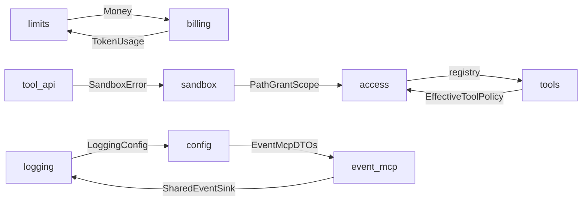

# Architecture review — 2026-09-29 (rust-skills)

Read-only audit of `agent_Kuibysheff` against the rust-skills catalog (Rust 2024 edition guidance; crate MSRV is 1.88, edition 2021). This document records what is already in good shape, which earlier findings are closed, and the new backlog items [13](13-typed-errors-over-string-sniffing.md)–[19](19-test-gaps-and-env-isolation.md).

Related: [index](README.md), [rust-review-findings.md](../rust-review-findings.md) (2026-08-04), [FURTHER_FIXES.md](../FURTHER_FIXES.md) (2026-07-11, superseded for open work).

## Scope and method

- Crates: root `agent_Kuibysheff` (`src/`), `crates/sandbox-linux`, `crates/sandbox-windows`.
- Cross-check against backlog items 01–12, the 2026-08-04 findings list, and `FURTHER_FIXES.md`.
- Evidence is `file:line` on `main` at the time of the review (`4a90c9e`).
- No code changes in this review. Items are documentation of follow-up work.

## What is already good

Do not re-open these.

- **Error spine.** Zero `.unwrap()` in non-test code. Domain modules use `thiserror` enums at their boundaries (`ConfigError`, `AccessError`, `AgentError`, `ToolError`, `McpError`, `BillingError`, `provider::Error`, `SandboxError`, `LoggingError`, `EventMcpError`, and the CLI command errors). `anyhow` is limited to composition in `src/app.rs` and `src/a2a/*`. No `downcast_ref` and no control flow that matches `anyhow` message text.
- **Async hygiene.** No `std::sync` guard is held across `.await`. Filesystem I/O on async paths is `tokio::fs` or `spawn_blocking`. The MCP actor and the JSONL sink from `FURTHER_FIXES.md` are in place. All seven `async_trait` traits (`ToolExecutor`, `ModelClient`, `SandboxBackend`, `CostResolver`, `EventSink`, `PipelineEvents`, `EventHandlerInvoker`) are object-safe and stored as `Arc<dyn …>`; native `async fn` in traits is used where there is no `dyn` (`TaskRunner` in `src/a2a/executor.rs`).
- **Unsafe boundary.** Root `Cargo.toml` sets `unsafe_code = "forbid"`. `unsafe` lives in the sandbox crates, with a `// SAFETY:` comment next to nearly every block. CI runs Miri on `sandbox-linux --lib`.
- **CI.** `cargo fmt --check`, `cargo clippy --workspace --all-targets -- -D warnings` on stable and MSRV 1.88 (Linux and Windows), lockfile check, `cargo deny`, gitleaks, coverage ratchet, Linux sandbox E2E.

## Verified closures (do not re-file)

| Earlier note | Status on 2026-09-29 |
|--------------|----------------------|
| [04](04-break-mcp-tools-cycle.md) `mcp` ↔ `tools` | **done.** `src/tool_api.rs` owns `ToolExecutor` and transport-neutral `ToolError`. The index still said `open`; corrected in this pass. |
| [05](05-break-config-access-cycle.md) `config` ↔ `access` | **done.** Raw DTOs live in `src/access/config.rs`. Index corrected in this pass. |
| rust-review warning 2 — cancel text said `max_duration_sec` | **closed.** Cancel arm calls `set_cancel_or_duration_stop` (`src/agent/loop/engine.rs`). |
| rust-review warning 3 — `ToolStart` without `ToolFinish` on cancel | **closed.** The cancel arm emits `ToolFinish` (`src/agent/loop/engine.rs:522`). |
| rust-review warning 9 — ACP sessions never removed | **closed.** LRU eviction in `src/acp/server.rs` (`evict_lru_session_if_needed`). |
| `FURTHER_FIXES` phase 1.2 — boundary error types | **done.** `agent/loop` does not import `openai_compat` or `stdio_client` for errors. |
| `FURTHER_FIXES` §2.3 — cancellation | **done** (item 07). Ctrl-C is wired for the A2A server only. |

## Findings

| ID | Sev | Area | Rules |
|----|-----|------|-------|
| [13](13-typed-errors-over-string-sniffing.md) | P1 | MCP HTTP fallback, access validation | `type-no-stringly`, `err-custom-type`, `pat-matches-macro`, `err-result-over-panic` |
| [14](14-break-remaining-module-cycles.md) | P1 | module graph | `proj-mod-by-feature`, `proj-pub-use-reexport`, `api-parse-dont-validate` |
| [15](15-newtype-ids-and-event-kinds.md) | P2 | IDs, audit events, `ToolExecutor` | `type-newtype-ids`, `type-newtype-validated`, `api-newtype-safety`, `type-no-stringly` |
| [16](16-config-deny-unknown-fields.md) | P2 | config DTOs | `serde-deny-unknown-fields`, `serde-default-compat` |
| [17](17-decompose-engine-run-inner.md) | P2 | agent loop, god-modules | `proj-mod-by-feature`, `mem-box-large-variant`, `anti-clone-excessive`, `perf-profile-first` |
| [18](18-app-composition-root-hygiene.md) | P2 | `src/app.rs` | `proj-lib-main-split`, `api-builder-pattern`, `api-non-exhaustive`, `test-cfg-test-module` |
| [19](19-test-gaps-and-env-isolation.md) | P3 | tests, sandbox, CLI | `test-cfg-test-module`, `test-fixture-raii`, `err-expect-bugs-only`, `async-cancel-safety` |

### Dependency cycles still present

Items [04](04-break-mcp-tools-cycle.md) and [05](05-break-config-access-cycle.md) removed the old `mcp` ↔ `tools` and `config` ↔ `access` type cycles. These remain (`use crate::`, or a fully qualified type such as `config` embedding `event_mcp::EventMcpConfig`):



Tracked as [14](14-break-remaining-module-cycles.md).

## Suggested execution order

```text
13 typed errors
 └─> 14 remaining module cycles
      └─> 16 deny_unknown_fields
           └─> 17 decompose run_inner (and continue 11)
                └─> 18 app.rs composition root
                     └─> 15 newtypes (stable tool_api change; version bump)
                          └─> 19 tests and env isolation
```

Item 15 changes the stable `tool_api` surface, so it waits until the cycle break in 14 has settled the module that owns `QualifiedTool` and `ToolExecutor`. Item 16 is a small, independent config change and can land earlier if a short PR is wanted first.
